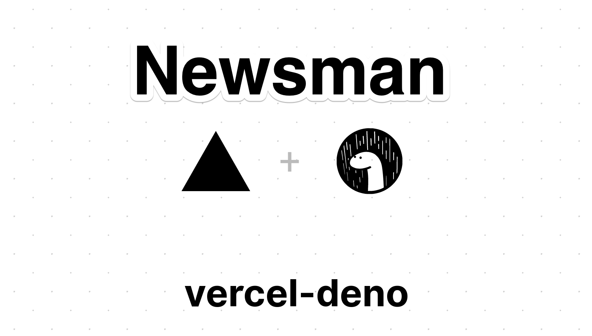

# Newsman

Deliver interesting news for you.

`TBD`: This project is currently in the planning stage.

## Usage

**Newsman** is Serverless Functions for frontend teams, and it use ▲ Vercel Runtime for 🦕 Deno serverless functions

About Vercel, get started by [Importing a Git Project](https://vercel.com/import) and use `git push` to deploy. Alternatively, you can [install Vercel CLI](https://vercel.com/download).

About Deno serverless functions, get started by [vercel-deno](https://github.com/TooTallNate/vercel-deno).

## Getting started

1. Install [Vercel CLI](https://vercel.com/download)
2. Clone this repository
3. vercel login
4. vercel dev

## How to Create a Release
If you have write access to this repository, you can read more about how to publish a release here.
